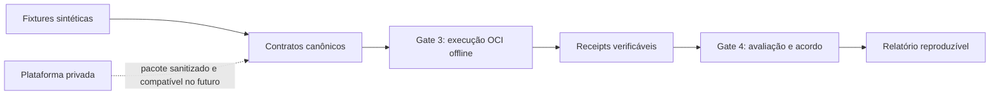

# SPEC-001 — Extração pública provider-free dos Gates 3 e 4

## Contexto e problema

O experimento de portabilidade depende de componentes técnicos que são úteis para
reprodução e escrutínio comunitário, mas o repositório da plataforma também contém
autenticação, integrações de produção e material de pesquisa privado. Copiar ou
forkar esse repositório publicamente seria uma fronteira de confiança inadequada e
poderia expor contexto de pesquisa, infraestrutura ou credenciais.

O repositório `autonom-ia-stage-gate` nasce com histórico independente para receber
somente componentes que executem com fixtures deliberadamente sintéticas. A
terminologia segue o processo de Stage-gate do TCC: Gate 3 reúne evidências
técnicas do desenvolvimento; Gate 4 reúne evidências técnicas de testes e
validação. O repositório não decide os Gates em nome da banca.

**Apetite:** um ciclo focado de extração segura. A entrega inicial não pode atrasar
nem alterar a execução privada do ensaio operacional.

## Objetivo

Disponibilizar um projeto Node.js independente, sob MIT, que execute e verifique
um fluxo técnico provider-free de Gate 3 e Gate 4, com contratos versionados,
isolamento OCI, avaliação e relatório baseados exclusivamente em dados sintéticos.

## Não-objetivos

- Publicar a plataforma, banco de dados, interface, autenticação ou bridge de
  exportação privada.
- Publicar entradas de Wizard, identificadores, cápsulas, resultados, recibos ou
  registros da coleta operacional.
- Despachar modelos, aceitar credenciais, aceitar endpoint de provedor ou executar
  cobrança por meio da CLI pública.
- Declarar que fixtures ou execuções públicas são resultado científico, ART-12,
  H1 ou aprovação formal de Gate.
- Tornar a primeira versão uma cópia completa do executor privado.

## Invariantes

- Um clone público passa seus testes sem variável de ambiente, rede de provedor,
  conta externa ou socket Docker.
- Cada fixture distribuída declara `synthetic: true` e
  `scientific_eligible: false` ou semântica equivalente verificável.
- Nenhum pacote importa SDK da plataforma, chama URL privada ou conhece uma
  credencial de pesquisa.
- A CLI pública não oferece flags de credencial, provedor, endpoint ou execução
  paga; entradas desconhecidas falham fechadas.
- A execução OCI pública aceita somente imagem fixada por digest e aplica
  isolamento explícito: usuário não-root, rootfs somente leitura, redução de
  capabilities, `no-new-privileges`, seccomp, tmpfs e limites de recursos.
- A avaliação pública não promete cegamento contra quem lê o próprio repositório:
  seus oráculos sintéticos são públicos por definição. O executor em integração
  deve, porém, separar em runtime o diretório/montagem da invocação daquele do
  avaliador e recusar acesso cruzado.
- O gate de segurança varre todos os arquivos rastreados e o diff proposto sem
  respeitar regras de ignore; builds de release exigem árvore limpa. Symlinks são
  rejeitados e arquivos de alto risco só podem existir mediante allowlist explícita.

## Desenho



A seta pontilhada é uma compatibilidade de esquema, não uma conexão de runtime. O
repositório público não acessa a plataforma e não conhece o conteúdo de um pacote
privado.

## Requisitos rastreáveis

| ID | Requisito | Prioridade | Critério de aceite | Status | Verificação |
|---|---|---:|---|---|---|
| PUB-01 | Como pesquisador, quero uma raiz pública independente para que o histórico privado não seja publicado. | P1 | `git log` mostra somente commits do repositório público e a árvore não contém arquivos da plataforma. | Concluído | verificado: repositório criado publicamente com commit raiz `455b57a` (31/08). |
| PUB-02 | Como mantenedor, quero barreiras automatizadas contra conteúdo privado para que uma contribuição insegura falhe antes do merge. | P1 | CI varre arquivos rastreados e diff sem usar ignore, recusa symlink/arquivos de alto risco e exercita canaries de segredo, import e URL privada. | Em progresso | em progresso: implementar detector local, manifesto de proveniência e testes negativos antes da extração de código. |
| PUB-03 | Como reprodutor, quero contratos canônicos e vetores sintéticos para verificar integridade sem acesso à plataforma. | P1 | Schema, canonicalização Unicode/ordem de bytes, SHA-256, lock e códigos de erro para versão incompatível têm vetores válidos/adulterados. | Pendente | — |
| PUB-04 | Como reprodutor, quero o Gate 3 provider-free para executar o isolamento e adapters offline sem conta de modelo. | P1 | Unitários não exigem Docker; o gate OCI opcional valida digest `sha256:<64-hex>`, `--network=none`, env vazio, mounts, non-root, read-only, capabilities, seccomp, tmpfs e CPU/memória/PIDs. Configuração externa é recusada. | Pendente | — |
| PUB-05 | Como reprodutor, quero o Gate 4 provider-free para avaliar resultados sintéticos de forma determinística. | P1 | Avaliação e relatório usam clock/seed/TZ/locale injetáveis, ordem canônica e golden hash; acordo ordinal usa alpha de Krippendorff e kappa quadrático ponderado em escala 1–5. | Pendente | — |
| PUB-06 | Como operador, quero um host reproduzível para validar Gates técnicos isolados. | P2 | Documentação e bootstrap Vagrant/KVM reproduzem o ambiente provider-free sem compartilhar diretórios sensíveis do host. | Pendente | — |
| PUB-07 | Como leitor, quero limites metodológicos claros para não confundir o projeto público com a coleta oficial. | P1 | README, fixtures, receipts e relatórios trazem marcação sintética e não-científica; teste impede sua remoção. | Em progresso | em progresso: a declaração existe no README; falta aplicá-la aos contratos e fixtures extraídos. |
| PUB-08 | Como comunidade, quero versões compatíveis e auditáveis. | P2 | Cada contrato possui schema/draft, versão explícita, vetores N/N-1 e política SemVer; incompatibilidade não sofre migração silenciosa. | Pendente | — |

## Plano de implementação

| Tarefa | Agente | Requisito(s) | Arquivos/áreas | Depende de | Done when | Gate |
|---|---|---|---|---|---|---|
| T1 — inventário de exportação | Laura | PUB-02, PUB-07 | `docs/`, `scripts/`, fixtures candidatas | — | Manifesto público registra destino, classificação, origem clean-room/reimplementada, hash e revisor; o mapa de caminhos privados fica fora deste repositório. | `npm run check:public-safety` |
| T2 — contratos e vetores | Diego | PUB-03, PUB-08 | `packages/contracts/`, `fixtures/synthetic/` | T1 | Contratos não têm dependência da plataforma e testes cobrem incompatibilidade. | `npm run test:contracts` (criado junto à T2) |
| T3 — executor G3 offline | Marcos | PUB-04 | `packages/executor/`, `docker/` | T2 | Policy e supervisor executam apenas adapter fake, falham para flags externas e separam runtime do avaliador. | `npm run test:executor` e `npm run test:oci` (opcional, sem rede) |
| T4 — avaliador G4 offline | Ricardo | PUB-05 | `packages/evaluator/`, `packages/qualitative/` | T2 | Fluxo end-to-end é determinístico e não usa rede; o isolamento de runtime é provado sem alegar sigilo para fixtures públicas. | `npm run test:evaluator` |
| T5 — host reproduzível | Sérgio | PUB-06 | `infra/vagrant-kvm/`, `docs/runbooks/` | T3 | Bootstrap e verificações não recebem segredo nem despacham provedor. | verificação provider-free documentada |
| T6 — endurecimento público | Helena | PUB-02, PUB-07, PUB-08 | CI, documentação e release | T1–T5 | DLP, canaries, política de versões e revisão de licença passam. | `npm test && npm run check:public-safety` |

## Matriz de testes

| Requisito | Tipo | Responsável | Comando/gate | Evidência esperada |
|---|---|---|---|---|
| PUB-01 | histórico/manual | Laura | `git log --all` | Um histórico raiz público, sem remotos privados. |
| PUB-02 | unitário/CI | Helena | `npm run check:public-safety` e `npm run test:public-safety` | Canary proibida, symlink, import e URL privada recusados. |
| PUB-03 | unitário | Diego | `npm run test:contracts` (criado junto à T2) | Vetores válidos passam; bytes, hash, versão ou lock adulterados falham. |
| PUB-04 | unitário/integração opcional | Marcos | `npm run test:executor`; `npm run test:oci` | Node unitário sem Docker; OCI offline prova policy e rejeita provider. |
| PUB-05 | e2e sintético | Ricardo | `npm run test:evaluator` | Ledger, acordo e relatório canônico são recalculáveis em TZ/locale distintos. |
| PUB-06 | manual/provider-free | Sérgio | runbook Vagrant/KVM | VM sem share amplo e sem dados sensíveis. |
| PUB-07 | regressão | Helena | `npm test` | Ausência da marcação não-científica causa falha. |
| PUB-08 | compatibilidade | Diego | `npm run test:contracts` | Vetores N/N-1; incompatibilidade recebe erro explícito, sem migração silenciosa. |

## Riscos e mitigações

| Risco | Mitigação |
|---|---|
| Vazamento por documentação, fixture ou histórico | Histórico novo, manifesto por arquivo, DLP sem ignore, canaries, revisão humana e recusa de symlinks. |
| Fixture que revele um projeto de pesquisa | Criar domínios fictícios novos; jamais derivar ou sanitizar por substituição de nomes. |
| CLI pública ganhar caminho pago por acidente | Não implementar interface de provedor na primeira versão; testar rejeição de flags, variáveis externas, egress e dependências HTTP/SDK. |
| Divergência entre contratos público e privado | Versionar schemas e verificar compatibilidade por vetores, não por cópia informal. |
| Confusão com evidência científica | Declarações negativas exigidas por contrato, fixture, receipt e relatório; oráculos públicos não recebem alegação de cegamento científico. |
| Extração atrapalhar a coleta privada | A extração é aditiva; não modifica o dispatch ou o armazenamento privado. |

## Perguntas abertas

Nenhuma bloqueia a fundação já publicada. A primeira release com código extraído só
ocorre após o manifesto de proveniência por arquivo, a revisão humana da lista de
arquivos permitidos, os canaries de DLP e a confirmação dos testes de
compatibilidade dos contratos.

## Validação

Antes da revisão de cada lote extraído, rodar:

```sh
npm test
npm run check:public-safety
```

## Próximo passo

Executar T1: inventário técnico de candidatos a exportação e manifesto de
proveniência, sem copiar código da plataforma ainda.
